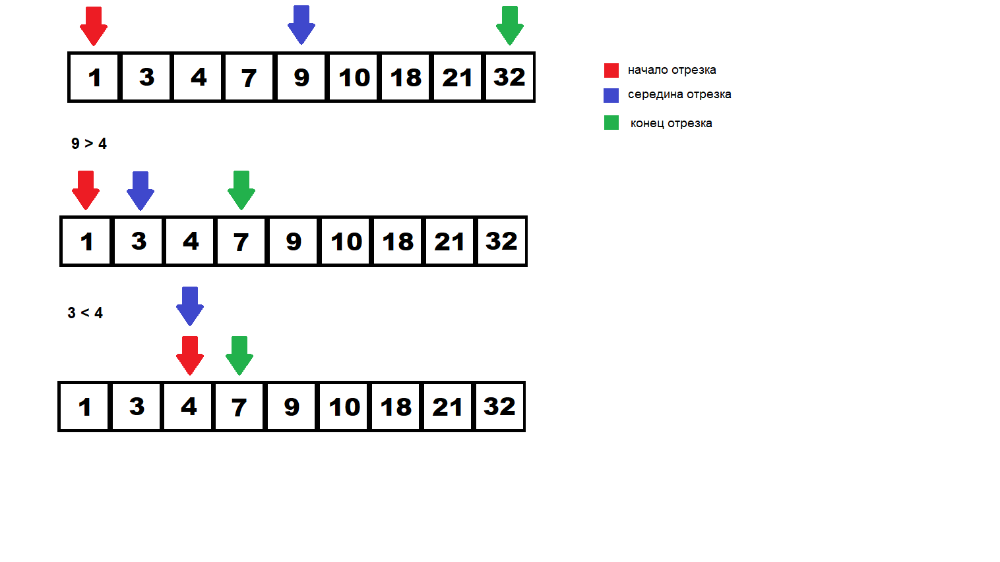
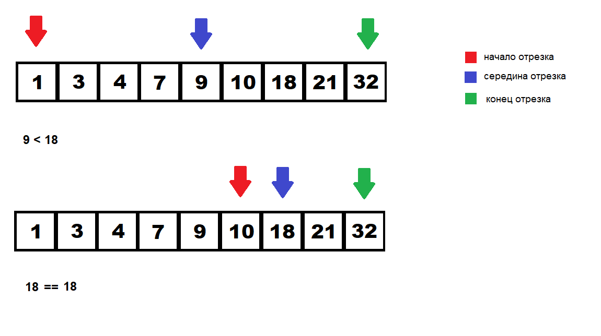

# Методы и процедуры поиска

## Последовательный поиск (линейный поиск)

Линейный поиск (называемый также последовательный поиск) является простейшим алгоритмом, перебирающим последовательно все элементы. Этот алгоритм неэффективен, и в наихудшем случае сложность алгоритма состовляет О($N$), однако единственно возможный в случае неупорядоченных данных. Если же у вас есть большие объёмы данных, удобнее будет эти данные предварительно отсортировать, а потом воспользоваться каким-либо другим алгоритмом поиска

__Код:__
```
size_t linearSearch(const std::vector<int>& arr, const int& searchData)
{
    for(size_t i = 0; i < arr.size(); i++)
    {
        if(arr.at(i) == searchData)
        {
            return i;
        }
    }

    return -1;
}
```

## Двоичный поиск (бинарный поиск)

Двоичный поиск, известный также как бинарный поиск, классический алгоритм поиска элемента в отсортированном массиве (векторе), использующий дробление массива на половины. Является адаптацией метода деления отрезка пополам.

Двоичный поиск можно применять только на отсортированной линейной структуре данных.

Если у нас дан массив __[1, 3, 4, 7, 9, 10, 18, 21, 32]__ и мы ищем значение 4, то поиск будет выглядеть следующим образом:



__Код:__

```
size_t binarySearch(const std::vector<int>& arr, const int& searchData)
{
    size_t low = 0;
    size_t high = arr.size() - 1;

    while(low <= high)
    {
        size_t midIndex = (low + high)  / 2;
        int midValue = arr.at(midIndex);

        if (midValue < searchData)
        {
            low = midIndex + 1;
        }
        else if (midValue > searchData)
        {
            high = midIndex - 1;
        }
        else
        {
            return midIndex;
        }
    }

    return -1; 
}
```

## Интерполяционный поиск

В отличие от двоичного (бинарного) поиска, интерполяционный поиск не делит последовательность на две равные части, а вычисляет приблизительное расположение ключа (искомого элемента), ориентируясь на расстояние между искомым и текущим значением элемента. 

Возьмём к примеру тот же массив __[1, 3, 4, 7, 9, 10, 18, 21, 32]__ и попытаемся найти число _18_. Поиск будет выглядить следующим образом: 



__Код:__
```
size_t interpolationSearch(const std::vector<int>& arr, const int& searchData)
{
    size_t low = 0;
    size_t high = arr.size() - 1;

    while(arr.at(low) < searchData && arr.at(high) > searchData && low <= high)
    {
        size_t mid = low + ((searchData - arr.at(low)) * (high - low)) / (arr.at(high) - arr.at(low));

        if(arr.at(mid) == searchData)
        {
            return mid;
        }
        else if(arr.at(mid) < searchData)
        {
            low = mid + 1;
        }
        else
        {
            high = mid - 1;
        }
    }

    return -1;
}
```

## Поиск Фибоначчи

Поиск Фибоначчи является адаптацией _метода золотого сечения_ для последовательностей. В этом поиске анализируются элементы, находящиеся в позициях, равных числам Фибоначчи. Числа Фибоначчи получаются по следующему правилу: последующее число равно сумме двух предыдущих чисел,и первые два числа обязательно равны 0 и 1. Таким образом выходит следующая __последовательность:__

__0,1,1,2,3,5,8,13,21,34,55,89,...__

Поиск продолжается до тех пор, пока не найден интервал между двумя ключами, где может располагаться отыскиваемый ключ. Возьмём для примера всё тот же упорядоченный массив __[1, 3, 4, 7, 9, 10, 18, 21, 32]__.

__Алгоритм:__
1. Инициализация

    1. Записываем число N, которое будет хранить данные о размерности нашего массива. В нашем случае N = 9.

    2. Ищем такой k, что  в последовательности Фибоначчи Fib(k + 1) элемент будет больше N, и это должен быть ближайший элемент, который больше N. Поскольку N = 9, а ближайший элемент в последовательности Фибоначчи, который больше 9 - это 13, в таком случае определяем позицию, на которой стоит число 13, то есть число 13 является 7-ым элементом в последовательности, таким образом k + 1 = 7, следовательно k = 6.

    3. Далее записываем число M, которое позволяет распространить поиск Фибоначчи на массив любой длины. M вычисляется по следующей формуле:

        M = Fib(k + 1) - (N + 1)

    4. Далее инициализируем индекс, который будет указывать на текущий элемент в массиве и сравнивать его с искомым элементом. Индекс инициализируется по следующей формуле:

        index = Fib(k) - M
        
    5.  Инициализируем две переменные p и q, которые будут сдвигать наш index влево или вправую сторону.

        p = Fib(k - 1)
        q = Fib(k - 2)
    
2. Сравнение
    
    1. Если q = 0 или p = 1, тогда поиск неудачный, и завершаем алгоритм.
    
    2. Проверить если искомый элемент больше, меньше или равен элементу в массиве, под индексом index.

        __Если array[index]__ > __искомого элемента__, тогда выполняется следующее:

        index = index - q
        
        tmp = q

        q = p - q

        p = tmp

        __Если array[index]__ < __искомого элемента__, тогда выполняется следующее:

        index = index + q

        p = p - q

        q = q - p

        __Если array[index]__ = __искомого элемента__, тогда завершаем алгоритм.


    


